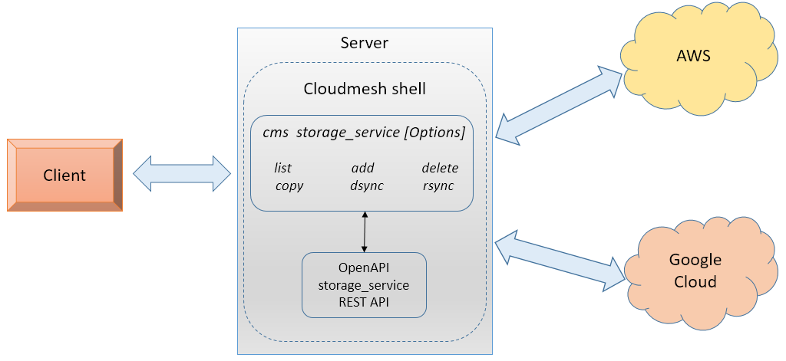

# Cloudmesh Storage Provider for Virtual Directories between  AWS and Google

Pratibha Madharapakkam Pagadala |  [fa19-516-152](https://github.com/cloudmesh-community/fa19-516-152)


[Project Code](https://github.com/cloudmesh-community/fa19-516-152/blob/master/project/project_code)  |  [Project Report](https://github.com/cloudmesh-community/fa19-516-152/blob/master/project/report.md) | [Contributors](https://github.com/cloudmesh-community/fa19-516-152/graphs/contributors)

## Introduction

This project is to develop API and rest services to manage and transfer
files between different cloud service providers. A cloudmesh based
command will be implemented to transfer files from a source to target
cloud provider. In this instance, the functionality will be implemented
for AWS and Google Cloud. For performance evaluation py tests will be
created.

## Motivation

 Multiple cloud providers offer storage solutions to manage data in the
 form of files. The intention here is to build a command which can
 provide functionality to move them from a source to a target cloud
 provider's storage. In this method, users will be able to split or move
 the data across different cloud providers that provider cheaper
 solutions.

## Architecture Diagram



Description

* Client intiates a cms storage_switch command with options such as
 
  1. Recursive file copy from source to target
  2. List the files
  3. Add the files
  4. delete the files
  
* Cloudmesh storage_switch command will run on the local server.
  According to the options and arguments, this would delegate the
  functions between AWS and Google Cloud.

* Storage and Utility APIs on AWS and Google cloud.   

## Technology Used

* cloudmesh-storage
* Python
* REST
* AWS S3 Storage
* Google Drive Storage
* OpenAPI

## Implementation Plan

````
Usage:
storage_service copy --source=SOURCE:SOURCE_FILE_DIR --target=TARGET:TARGET_FILE_DIR
storage_service list --source=SOURCE:SOURCE_FILE_DIR
storage_service delete --source=SOURCE:SOURCE_FILE_DIR

This command does some useful things.

Arguments:
 SOURCE:SOURCE_FILE_DIR   source provider name : file or directory name
 TARGET:SOURCE_FILE_DIR   destination provider name

Options:
 --source=SOURCE:SOURCE_FILE_DIR      specify the cloud:location
 --target=TARGET:LOCATION      specify the target:location

Description:
Command enables to Copy files between different cloud service providers, list and delete them.
This command accepts "aws" , "google" and "local" as the SOURCE and TARGET provider

cms storage_service copy --source=SOURCE:SOURCE_FILE_DIR --target=TARGET:TARGET_FILE_DIR
 Command copies files or directories from Source provider to Target Provider.

cms storage_service list --source=SOURCE:SOURCE_FILE_DIR
 Command lists all the files present in SOURCE provider's in the given SOURCE_FILE_DIR location
		This command accepts "aws" or "google" as the SOURCE provider

cms storage_service delete --source=SOURCE:SOURCE_FILE_DIR
 Command deletes the file or directory from the SOURCE provider's SOURCE_FILE_DIR location

Example:
cms storage_service copy --source=local:test1.txt --target=aws:uploadtest1.txt
cms storage_service list --source=google:test
cms storage_service delete --source=aws:uploadtest1.txt

````
## Dependencies / Constraints

* storage service command utiltizes cloudmesh awss3's Provider class for list, put, get and delete methods.
  
* Google Cloud Provider is developed using google's Storage API. 
  
* The command has been tested on Windows 10.

## Testing

PyTest have been executed to test the functionality - [Code](https://github.com/cloudmesh-community/fa19-516-152/blob/master/project/project_code/cloudmesh-storage_service/cloudmesh/storage_service/test/Test_storage_service.py)

pytest -v --capture=no -W ignore::DeprecationWarning /test/Test_storage_service.py > testResults.txt 

## Benchmarks

Benchmarks results - [storage_service benchmarks](https://github.com/cloudmesh-community/fa19-516-152/blob/master/project/project_code/cloudmesh-storage_service/cloudmesh/storage_service/test/testResults.txt)

```
+-------------------+-----------------------------------------------------------------------------------+
| Machine Attribute | Value                                                                             |
+-------------------+-----------------------------------------------------------------------------------+
| cpu_count         | 4                                                                                 |
| mac_version       |                                                                                   |
| machine           | ('AMD64',)                                                                        |
| mem_available     | 3.4 GiB                                                                           |
| mem_free          | 3.4 GiB                                                                           |
| mem_percent       | 56.8%                                                                             |
| mem_total         | 7.9 GiB                                                                           |
| mem_used          | 4.5 GiB                                                                           |
| node              | ('PratiSree',)                                                                    |
| platform          | Windows-10-10.0.18362-SP0                                                         |
| processor         | ('Intel64 Family 6 Model 69 Stepping 1, GenuineIntel',)                           |
| processors        | Windows                                                                           |
| python            | 3.7.4 (tags/v3.7.4:e09359112e, Jul  8 2019, 20:34:20) [MSC v.1916 64 bit (AMD64)] |
| release           | ('10',)                                                                           |
| sys               | win32                                                                             |
| system            | Windows                                                                           |
| user              |                                                                                   |
| version           | 10.0.18362                                                                        |
| win_version       | ('10', '10.0.18362', 'SP0', '')                                                   |
+-------------------+-----------------------------------------------------------------------------------+
```

```
+------------------+-------+
| timer            | time  |
+------------------+-------+
| LIST AWS         | 2.735 |
| LIST GOOGLE      | 0.475 |
| LOCAL_TO_AWS_DIR | 1.238 |
| AWS_TO_LOCAL_DIR | 0.694 |
| AWS_TO_LOCAL     | 1.582 |
| LOCAL_TO_AWS     | 0.819 |
| AWS_TO_GOOGLE    | 3.069 |
| GOOGLE_TO_LOCAL  | 0.667 |
| LOCAL_TO_GOOGLE  | 0.588 |
| GOOGLE_TO_AWS    | 2.16  |
| DELETE GOOGLE    | 0.544 |
| DELETE AWS       | 1.338 |
+------------------+-------+
```

## References

* <https://github.com/googleapis/google-cloud-python#google-cloud-python-client>
* <https://aws.amazon.com/s3/>
* <https://boto3.amazonaws.com/v1/documentation/api/latest/guide/resources.html>
* <https://github.com/cloudmesh/cloudmesh-storage/tree/master/cloudmesh/storage>
